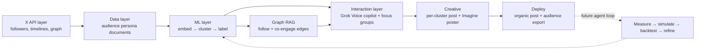

# AgentSim — System Architecture

*Companion to [VISION.md](VISION.md) · xAI Grokathon · August 2026*

## High level

A founder briefs a voice-driven agent on their launch. The system has already indexed their X audience into interest tribes; the agent turns the founder's goal into a targeting decision and emits tailored creative (post + Grok Imagine poster) per targeted tribe, then deploys and exports Ads-ready audiences.



P0 is the solid path (ingest → cluster → target → creative → deploy). The dashed loop — real-engagement measurement, AgentTorch-style population simulation, and backtesting — is the post-hackathon iteration engine.

## 1. X API layer

**Purpose:** pre-index the founder's audience at login / on-demand; discover connected populations worth targeting.

- Fetch followers/following of the authenticated founder (`GET /2/users/:id/followers`, `/following` — 1000/page, ~300 req/15 min).
- Per-follower enrichment: `user.fields` (bio, metrics, verified, location, entities, pinned post) + `GET /2/users/:id/tweets` (last 10–50 posts: text, entities, context annotations, metrics) + optional liked tweets / following sample.
- Secondary-population discovery: followers of seed accounts, likers of similar launches, mutuals of top engagers.
- **Rate-limit strategy — two-tier sampling (all configurable):**
  - Tier 1, `SAMPLE_MAX = 10_000`: bios + metrics come free with the followers-list fetch (1000 users/page → 10 calls for 10k).
  - Tier 2, `DEEP_ENRICH_MAX ≈ 1_500`: stratified deep sample (top engagers + high-influence + random) gets timelines + following lists — the expensive per-user calls. Deep sample drives clustering; remaining followers are assigned to clusters by bio-embedding similarity so everyone lands in an exportable tribe.
  - **No per-follower following-list fetch.** Pay-per-use bills ~$0.01 per followed record → $3–5 per follower, four figures per audience — and the long tail you pay most for carries zero clustering signal. Cut from P0 (Sam's cost check).
  - Anchor accounts, free variant: aggregate `entities.mentions` + `referenced_tweets` from the deep sample's already-fetched timelines → accounts mentioned/amplified by ≥ `ANCHOR_MIN_SUPPORT = 1%` of the deep sample, bounded by `ANCHOR_MIN/MAX = 100/500`. Active-engagement signal, zero marginal fetch cost; enrich the few hundred anchors via batch lookup, one Grok pass tags them into topics. Bonus block in the persona document, not required (mentions are sparser than follows).
  - Aggressive caching, parallel fetch with backoff. Precompute demo accounts before demo day.

**Output:** raw user objects + timelines → cleaned audience documents for the Data layer.

## 2. Data layer

**The embeddable object** is a rich **Audience Persona Document** per follower:

```
[Profile] name/@handle · account age · verified · follower/following/listed counts
Bio + entities · location/website signals
Metrics summary: activity level, influence ratio, engagement style
Content signature (last N posts): topics/hashtags, sample texts, media presence, reply-vs-original ratio
Behavioral signals: liked-content themes, frequently mentioned/amplified accounts (from own timeline — no follows fetch)
LLM persona card (Grok, high-ROI): ranked interests, archetype, preferred formats, tone affinity, conversion levers
```

**Storage:** raw X objects in Postgres/SQLite/DuckDB · persona docs + embeddings in a vector store (Chroma/FAISS/LanceDB) · cluster centroids, labels, exemplars · graph edges (NetworkX in-memory is enough for the weekend) · historical post performance for the future backtesting loop.

## 3. ML layer

**Embeddings — note: there is no Grok/xAI embeddings API.** Pipeline: Grok generates a clean persona summary / structured JSON from the persona document (this is where semantic quality comes from), then embed that with an open-source model (e.g., bge/gte via sentence-transformers — local, free, fast) or a third-party embeddings API. Optional hybrid: dense vector + sparse hashtag TF-IDF.

**Clustering:** UMAP → HDBSCAN (or KMeans fallback) → Grok auto-labels each cluster ("mid-stage technical founders who bookmark deep product breakdowns"). Store centroids, exemplars, feature importance. Prior art worth citing in the pitch: X's own [SimClusters](https://github.com/twitter/the-algorithm/tree/main/src/scala/com/twitter/simclusters_v2) — community-based embeddings power X's recommendations; we build the founder-facing version.

**Post scoring:** embed a candidate post the same way → cosine similarity to cluster centroids → Grok reasons over the match ("scores 0.84 on Cluster A, expect high bookmarks; weak on Cluster B").

**Large population models (future — see agent loop):** map clusters to agent archetypes, AgentTorch-style ([agenttorch/agenttorch](https://github.com/agenttorch/agenttorch)), simulate post diffusion and counterfactuals.

## 4. Graph RAG

Multi-relational graph built from affordable edges only: **co-engagement** (liking_users + retweeted_by on the founder's ~25 recent posts — ~$50 bounded, and the same data stratifies the deep sample), mention/amplification edges from deep-sample timelines (free), embedding-similarity edges, cluster membership. One matrix pays three times: Leiden/Louvain communities cross-tabbed against embedding clusters (the SimClusters validation line for judges), Graph RAG grounding for focus-group mode and "who bridges tribe A and B" queries, and galaxy-viz edges. Follow edges among followers are explicitly out (per-record pricing).

## 5. Interaction layer

- **Grok Voice copilot** (text fallback): brief it on the launch; it inspects clusters, makes targeting decisions, generates/rewrites variants per cluster, requests Grok Imagine visuals, and (future) runs what-if queries against the population model. Multi-turn memory of the founder's goals.
- **Focus group mode:** voice-interview a cluster persona, grounded via Graph RAG retrieval over that cluster's real posts.
- **UI stretch:** 3D force-directed audience galaxy (nodes sized by influence, colored by cluster), with Grok Imagine thematic art.

## 6. Agent loop for iteration (future)

Ingest/refresh → embed + cluster → propose variants → score + population-simulate → present predicted metrics + rationale → founder approves → publish via X API → pull real engagement → update models. Semi-autonomous with human-in-the-loop approval on the final post.

## 7. Backtesting + metrics layer (future)

- **Historical:** replay the founder's past posts; which clusters did they actually hit?
- **Simulated:** population runs produce predicted likes/bookmarks/replies/cascade depth.
- **Live:** predicted vs. actual after each publish; lift by cluster.
- **Core metrics:** engagement rate by cluster, bookmark rate (high-signal intent), reply quality, follower-growth attribution, reach into secondary populations.

## Hosting & MCP access

- **Postgres + pgvector on Neon** — the shared substrate. Ingest writes PersonaDocuments; ML writes embeddings + cluster assignments; MCP server reads everything. Services never call each other directly; they meet at the DB.
- **One Python service on Railway = MCP server + job runner.** FastMCP (streamable HTTP) exposing layer B as tools: `run_clustering`, `get_run_status`, `list_clusters`, `get_cluster` (persona card + exemplars — the focus-group grounding), `score_post`, `export_audience`. Clustering (~30–90 s CPU at 1.5k docs) runs in-process via a thread + run-registry — no queue, no workers. Auth = static bearer token env var.
- **Next.js app on Vercel**, consuming the MCP server via the AI SDK's MCP client — the copilot is just the MCP server's first client; any MCP-speaking agent (Claude, Cursor) can connect to the same URL. That's a demo asset, not just plumbing.
- **Fallback:** the identical stack runs on a laptop — FastMCP local + `cloudflared tunnel` for a public HTTPS URL, Neon reachable from anywhere. Develop this way; deploy to Railway when stable.
- Deliberately excluded: serverless for the Python side (cold starts + numba build pain, zero benefit at this job size), job queues, artifact stores (reports serve from the service filesystem).

## Data lifecycle (three loops)

1. **Query loop** (ms, every copilot turn): targeting, focus-group retrieval, post scoring, export — strictly read-only over precomputed state. Voice feels instant because nothing computes here.
2. **Refresh loop** (minutes, on connect / daily): delta ingest from the last cursor → embed only new docs (content-hash cache) → **assign new users to existing clusters** (tier-1 path — centroid lookup, cluster IDs stay stable). No reclustering.
3. **Rebuild loop** (rare — config change, drift, weekly): full re-embed + recluster + relabel in the background. Drift trigger comes free from loop 2: rising fraction of low-confidence assignments ⇒ tribes no longer fit ⇒ rebuild.

Mechanisms: content-addressed caching everywhere (embeddings keyed by model+composition+doc hash — built; raw X responses TTL-cached ~7d in ingest — the highest-ROI cache since ingest is the only real dollar cost); immutable versioned cluster runs with an `active_run_id` pointer per account, swapped atomically — no half-built state, A/B-able versions, rollback = repoint. The future agent-iteration loop plugs in as "new run version + engagement data."

MCP surface mirrors the split: `prepare_audience(account)` is the one long-running tool (idempotent, checkpointed per stage: ingested → carded → embedded → clustered → labeled); every other tool is a fast read. Demo accounts are fully materialized before demo day — judges only ever wait on variant generation and scoring.

## Cluster storage schema (full user ↔ cluster associativity)

Three tables in Neon, replacing the `clusters.json` file / `clusters_stub` as source of truth. Design principles: membership is a first-class row indexed in both directions (cluster→users AND user→cluster are one indexed query each); runs are immutable versions with a partial-unique `active` pointer (the lifecycle's atomic swap); profile data lives only in `personas` — membership points at it, never copies it.

- **`cluster_runs`** — `run_id` PK, `seed_account_id`, `status` (building | active | archived), `config` JSONB (composition, embedder+version, algo), `metrics` JSONB. Unique partial index: one `active` run per seed account.
- **`clusters`** — PK `(run_id, cluster_id)`: `label`, `doc` JSONB (one-liner, keywords, persona card, exemplar ids), `size`, `share_of_audience`, `engagement_index`, `centroid`.
- **`cluster_members`** — PK `(run_id, user_id)` ⟵ encodes the invariant "one cluster per user per run, no orphans": `cluster_id`, `periphery` (HDBSCAN noise flag), `confidence` (tier-1 assignment ratio), `map_x/map_y` (display-projection coords — the galaxy view renders and click-throughs straight from this table). Indexes: `(run_id, cluster_id)` and `(user_id)`.

Click-throughs: cluster view → member profiles = `cluster_members ⋈ personas`; user search → their tribe = `cluster_members ⋈ clusters` filtered to the active run. Old runs stay queryable (audience drift over time); soft membership later = relax the PK + add a weight column. The frontend `AudienceProvider` interface maps onto this directly (mock adapter swaps for a DB-backed one, UI unchanged).

## Team split (4 people)

- **A — Ingestion & X API:** auth, follower fetch + enrichment, sampling/caching, raw storage, write path (Read+Write token, posting, audience export). Precomputes demo-account persona documents. *Stretch: discovery seed.*
- **B — ML pipeline:** Grok persona cards → embeddings → UMAP/HDBSCAN → cluster labeling → centroids/exemplars, post scoring, basic graph. *Stretch: probabilistic engagement simulator.*
- **C — Agent & Grok surface:** copilot tool-calling loop (targeting decisions, variant generation), Grok Imagine posters, focus-group persona mode, Grok Voice.
- **D — UI & demo glue:** audience map, variant grid, chat/voice shell, deploy/export UX. **Owns integration + the demo script.**

**Freeze two contracts in hour one so everyone works in parallel against mocks:**
1. `PersonaDocument` schema (A → B) — B starts on ~50 synthetic documents; real data swaps in later.
2. `Cluster` schema (B → C, D) — id, label, persona card, size, exemplars, member IDs; C and D build against a mocked `clusters.json` from minute one.

**Sync points:** end of night one — real data flows A→B→C→D once; midday day two — feature freeze, rehearse D's demo script. Cut order if slipping: voice → discovery flourish → galaxy viz; never the core cluster → target → creative loop.

## Prioritized 12-hour build path

**Must-have core:** followers + profiles + recent posts → persona documents → Grok persona cards → embeddings → clustering + labeling · vector store · Grok voice/chat copilot that targets clusters and drafts variants + Imagine posters · basic graph (similarity + follow sample) · post + export deploy.

**High-impact stretch:** persona enrichment depth · audience galaxy visualization · discovery seed (competitor followers, precomputed) · lightweight probabilistic engagement simulator · backtest on the founder's own history.
