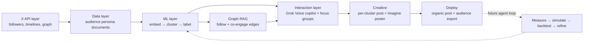

# AgentSim — System Architecture

*Companion to [VISION.md](VISION.md) · xAI Grokathon · August 2026*

## High level

A founder briefs a voice-driven agent on their launch. The system has already indexed their X audience into interest tribes; the agent turns the founder's goal into a targeting decision and emits tailored creative (post + Grok Imagine poster) per targeted tribe, then deploys and exports Ads-ready audiences.



P0 is the solid path (ingest → cluster → target → creative → deploy). The dashed loop — real-engagement measurement, AgentTorch-style population simulation, and backtesting — is the post-hackathon iteration engine.

## 1. X API layer

**Purpose:** pre-index the founder's audience at login / on-demand; discover connected populations worth targeting.

- Fetch followers/following of the authenticated founder (`GET /2/users/:id/followers`, `/following` — 1000/page, ~300 req/15 min).
- Per-follower enrichment: `user.fields` (bio, metrics, verified, location, entities, pinned post) + `GET /2/users/:id/tweets` (last 10–50 posts: text, entities, context annotations, metrics) + optional liked tweets / following sample.
- Secondary-population discovery: followers of seed accounts, likers of similar launches, mutuals of top engagers.
- **Rate-limit strategy:** stratified sampling (recent + high-metric + verified first), hard caps, aggressive caching, parallel fetch with backoff. Precompute demo accounts before demo day.

**Output:** raw user objects + timelines → cleaned audience documents for the Data layer.

## 2. Data layer

**The embeddable object** is a rich **Audience Persona Document** per follower:

```
[Profile] name/@handle · account age · verified · follower/following/listed counts
Bio + entities · location/website signals
Metrics summary: activity level, influence ratio, engagement style
Content signature (last N posts): topics/hashtags, sample texts, media presence, reply-vs-original ratio
Behavioral signals: liked-content themes, sampled following interests
LLM persona card (Grok, high-ROI): ranked interests, archetype, preferred formats, tone affinity, conversion levers
```

**Storage:** raw X objects in Postgres/SQLite/DuckDB · persona docs + embeddings in a vector store (Chroma/FAISS/LanceDB) · cluster centroids, labels, exemplars · graph edges (NetworkX in-memory is enough for the weekend) · historical post performance for the future backtesting loop.

## 3. ML layer

**Embeddings — note: there is no Grok/xAI embeddings API.** Pipeline: Grok generates a clean persona summary / structured JSON from the persona document (this is where semantic quality comes from), then embed that with an open-source model (e.g., bge/gte via sentence-transformers — local, free, fast) or a third-party embeddings API. Optional hybrid: dense vector + sparse hashtag TF-IDF.

**Clustering:** UMAP → HDBSCAN (or KMeans fallback) → Grok auto-labels each cluster ("mid-stage technical founders who bookmark deep product breakdowns"). Store centroids, exemplars, feature importance. Prior art worth citing in the pitch: X's own [SimClusters](https://github.com/twitter/the-algorithm/tree/main/src/scala/com/twitter/simclusters_v2) — community-based embeddings power X's recommendations; we build the founder-facing version.

**Post scoring:** embed a candidate post the same way → cosine similarity to cluster centroids → Grok reasons over the match ("scores 0.84 on Cluster A, expect high bookmarks; weak on Cluster B").

**Large population models (future — see agent loop):** map clusters to agent archetypes, AgentTorch-style ([agenttorch/agenttorch](https://github.com/agenttorch/agenttorch)), simulate post diffusion and counterfactuals.

## 4. Graph RAG

Multi-relational graph: follow edges, co-engagement (liked same posts / same threads), embedding-similarity edges, cluster membership. Retrieval pulls a user's 1–2 hop neighborhood, mutuals, and high-influence bridges — enabling questions like "who bridges my technical builders and my investor cluster?"

## 5. Interaction layer

- **Grok Voice copilot** (text fallback): brief it on the launch; it inspects clusters, makes targeting decisions, generates/rewrites variants per cluster, requests Grok Imagine visuals, and (future) runs what-if queries against the population model. Multi-turn memory of the founder's goals.
- **Focus group mode:** voice-interview a cluster persona, grounded via Graph RAG retrieval over that cluster's real posts.
- **UI stretch:** 3D force-directed audience galaxy (nodes sized by influence, colored by cluster), with Grok Imagine thematic art.

## 6. Agent loop for iteration (future)

Ingest/refresh → embed + cluster → propose variants → score + population-simulate → present predicted metrics + rationale → founder approves → publish via X API → pull real engagement → update models. Semi-autonomous with human-in-the-loop approval on the final post.

## 7. Backtesting + metrics layer (future)

- **Historical:** replay the founder's past posts; which clusters did they actually hit?
- **Simulated:** population runs produce predicted likes/bookmarks/replies/cascade depth.
- **Live:** predicted vs. actual after each publish; lift by cluster.
- **Core metrics:** engagement rate by cluster, bookmark rate (high-signal intent), reply quality, follower-growth attribution, reach into secondary populations.

## Team split (4 people)

- **A — Ingestion & X API:** auth, follower fetch + enrichment, sampling/caching, raw storage, write path (Read+Write token, posting, audience export). Precomputes demo-account persona documents. *Stretch: discovery seed.*
- **B — ML pipeline:** Grok persona cards → embeddings → UMAP/HDBSCAN → cluster labeling → centroids/exemplars, post scoring, basic graph. *Stretch: probabilistic engagement simulator.*
- **C — Agent & Grok surface:** copilot tool-calling loop (targeting decisions, variant generation), Grok Imagine posters, focus-group persona mode, Grok Voice.
- **D — UI & demo glue:** audience map, variant grid, chat/voice shell, deploy/export UX. **Owns integration + the demo script.**

**Freeze two contracts in hour one so everyone works in parallel against mocks:**
1. `PersonaDocument` schema (A → B) — B starts on ~50 synthetic documents; real data swaps in later.
2. `Cluster` schema (B → C, D) — id, label, persona card, size, exemplars, member IDs; C and D build against a mocked `clusters.json` from minute one.

**Sync points:** end of night one — real data flows A→B→C→D once; midday day two — feature freeze, rehearse D's demo script. Cut order if slipping: voice → discovery flourish → galaxy viz; never the core cluster → target → creative loop.

## Prioritized 12-hour build path

**Must-have core:** followers + profiles + recent posts → persona documents → Grok persona cards → embeddings → clustering + labeling · vector store · Grok voice/chat copilot that targets clusters and drafts variants + Imagine posters · basic graph (similarity + follow sample) · post + export deploy.

**High-impact stretch:** persona enrichment depth · audience galaxy visualization · discovery seed (competitor followers, precomputed) · lightweight probabilistic engagement simulator · backtest on the founder's own history.
